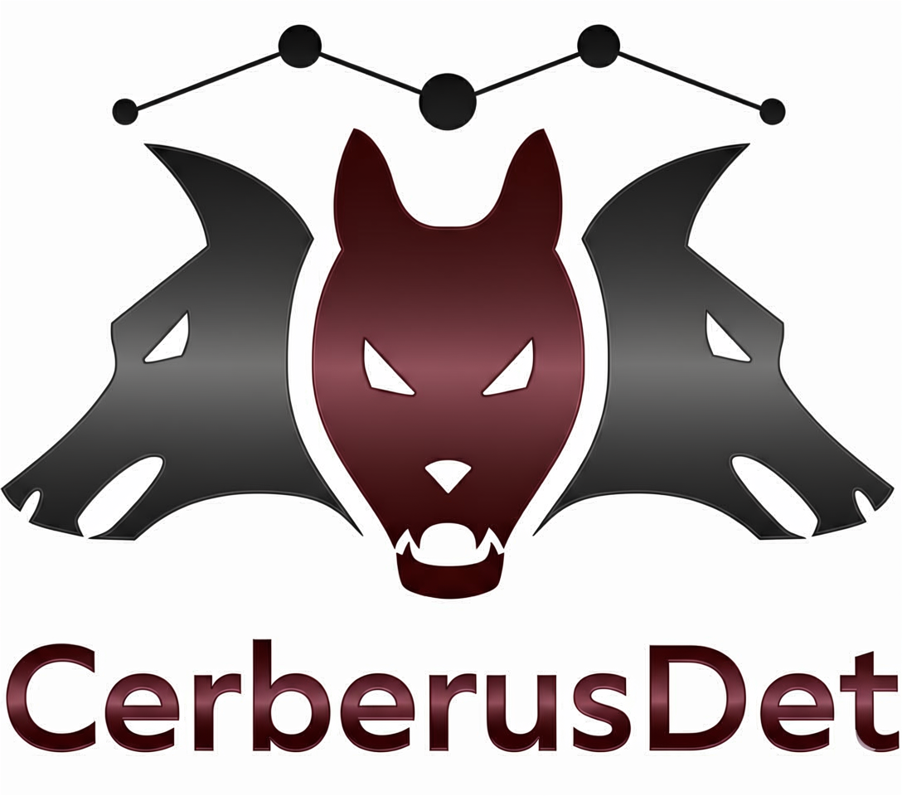

<div align="center">
<p>
<a align="left"  target="_blank">
</a>
</p>
<br>

<br>
</div>

### CerberusDet: Unified Multi-Dataset Object Detection

[[`Paper`](http://arxiv.org/abs/2407.12632)]

---

The code is based on:

- [YOLOv8](https://github.com/ultralytics/ultralytics)
- [YOLOv5](https://github.com/ultralytics/yolov5)


### Install

[**Python>=3.8.0**](https://www.python.org/) is required.
```bash
$ git clone
$ pip install -e .
```

### Docker

Run the docker:

```bash
sudo docker-compose up -d
sudo docker attach cerberusdet_cerber_1
```
### Data

- Use script [voc.py](data/scripts/voc.py) to download VOC dataset

For information about the VOC dataset and its creators, visit the [PASCAL VOC dataset website](http://host.robots.ox.ac.uk/pascal/VOC/).
- Use script [objects365_part.py](data/scripts/objects365_part.py) to download subset of Objects365 dataset with 19 animals categories:
```
['Monkey', 'Rabbit', 'Yak', 'Antelope', 'Pig',  'Bear', 'Deer', 'Giraffe', 'Zebra', 'Elephant',
'Lion', 'Donkey', 'Camel', 'Jellyfish', 'Other Fish', 'Dolphin', 'Crab', 'Seal', 'Goldfish']
```
Along with Objects365 subset with 12 tableware categories:
```
  [ 'Cup', 'Plate', 'Wine Glass', 'Pot', 'Knife', 'Fork', 'Spoon', 'Chopsticks',
    'Cutting/chopping Board', 'Tea pot', 'Kettle', 'Tong']
```
To download full Objects365 dataset, set `DOWNLOAD_SUBSETS = False` in the script [objects365_part.py](data/scripts/objects365_part.py).

The Objects365 dataset is available for the academic purpose only. For information about the dataset and its creators, visit the [Objects365 dataset website](https://www.objects365.org/).

### Train

- Download pretrained on COCO [yolov8 weights](https://drive.google.com/file/d/1A3ukDEBNqfgreaMrju66XDIiLEfBkEZH/view?usp=sharing)
- Run train process with 1 GPU
```bash
$ python3 cerberusdet/train.py \
--img 640 --batch 32 \
--data data/voc_obj365.yaml \
--weights pretrained/yolov8x_state_dict.pt \
--cfg cerberusdet/models/yolov8x_voc_obj365.yaml \
--hyp data/hyps/hyp.cerber-voc_obj365.yaml \
--name voc_obj365_v8x --device 0
```
- OR run train process with several GPUs:
```bash
$ CUDA_VISIBLE_DEVICES="0,1,2,3" \
python -m torch.distributed.launch --nproc_per_node 4 cerberusdet/train.py \
--img 640 --batch 32 \
--data data/voc_obj365.yaml \
--weights pretrained/yolov8x_state_dict.pt \
--cfg cerberusdet/models/yolov8x_voc_obj365.yaml \
--hyp data/hyps/hyp.cerber-voc_obj365.yaml \
--name voc_obj365_v8x \
--sync-bn
```
By default logging will be done with tensorboard, but you can use mlflow if set --mlflow-url, e.g. `--mlflow-url localhost`.

<details>
<summary>CerberusDet model config details </summary>

Example of the model's config for 2 tasks: [yolov8x_voc_obj365.yaml](cerberusdet/models/yolov8x_voc_obj365.yaml)

- The model config is based on yolo configs, except that the `head` is divided into two sections (`neck` and `head`)
- The layers of the `neck` section can be shared between tasks or be unique
- The `head` section defines what the head will be for all tasks, but each task will always have its own unique parameters
- The `from` parameter of the first neck layer must be a positive ordinal number, specifying from which layer, starting from the beginning of the entire architecture, to take features.
- The `cerber` section is optional and defines the architecture configuration for determining the neck layers to be shared among tasks. If not specified, all layers will be shared among tasks, and only the heads will be unique.
- The CerberusDet configuration is constructed as follows:<br>
  `cerber: List[OneBranchConfig]`, where<br>
  &nbsp; `OneBranchConfig = List[cerber_layer_number, SharedTasksConfig]`, where<br>
  &nbsp; &nbsp; &nbsp; `cerber_layer_number` - the layer number (counting from the end of the backbone) after which branching should occur<br>
  &nbsp; &nbsp; &nbsp; `SharedTasksConfig = List[OneBranchGroupedTasks]`, where<br>
  &nbsp; &nbsp; &nbsp; &nbsp; &nbsp; &nbsp; `OneBranchGroupedTasks = [number_of_task1_head, number_of_task2_head, ...]` - the task head numbers (essentially task IDs) that should be in the same branch and share layers thereafter<br><br>
  The head numbers will correspond to tasks according to the sequence in which they are listed in the data configuration.<br><br>
  Example for YOLO v8x:<br>
  `[[2, [[15], [13, 14]]], [6, [[13], [14]]]]` - configuration for 3 tasks. Task id=15 will have all task-specific layers, starting from the 3rd. Tasks id=13, id=14 will share layers 3-6, then after the 6th, they will have their own separate branches with all layers.

</details>

### Evaluation

- Download CerberusDet checkpoint (see below)
- Run script [bash_scripts/val.sh](bash_scripts/val.sh)

### Inference

You can run inference using either the provided bash script or directly via the Python API.

#### 1. Using Bash Script
First, download the CerberusDet checkpoint trained on VOC and parts of the Objects365 dataset (see the **Pretrained Checkpoints** section below).

Then, run the detection script:
```bash
./bash_scripts/detect.sh
```

#### 2. Using Python API
You can also integrate CerberusDet into your own code. Below is an example of how to initialize the model, preprocess images, and visualize the results.

```python
import cv2
from cerberusdet.cerberusdet_inference import CerberusDetInference, CerberusVisualizer
from cerberusdet.cerberusdet_preprocessor import CerberusPreprocessor

# 1. Configuration
weights_path = 'weights/voc_obj365_v8x_best.pt'
img_path = 'data/images/bus.jpg'
device = 'cuda:0'

# 2. Initialize model, preprocessor, and visualizer
inferencer = CerberusDetInference(
    weights=weights_path,
    device=device,
    conf_thres=0.3,
    iou_thres=0.45,
    half=True
)

# Note: Pass the model's stride to the preprocessor
preprocessor = CerberusPreprocessor(
    img_size=640,
    stride=inferencer.stride,
    device=device,
    half=inferencer.half,
    auto=True
)

visualizer = CerberusVisualizer(line_thickness=2, text_scale=0.5)

# 3. Load images
# The preprocessor expects a list of numpy arrays (BGR)
images = [cv2.imread(img_path)]
original_shapes = [img.shape[:2] for img in images]

# 4. Run inference
img_tensor = preprocessor.preprocess(images)
detections = inferencer.predict(img_tensor, original_shape=original_shapes)

# Visualization
res_image = visualizer.draw_detections(
    images[0],
    detections[0],
    hide_task=False,  # Show task name (VOC, O365, etc.)
    hide_conf=False   # Show confidence score
)

# 5. Output / Save results
print(f"Found objects: {len(detections[0])}")
for det in detections[0]:
    print(f"{det['label_name']} ({det['score']:.2f}) - Task: {det['task']}")

cv2.imshow("CerberusDet Result", res_image)
cv2.imwrite("result.jpg", res_image)

cv2.waitKey(0)
cv2.destroyAllWindows()
```

> **NOTE:** To run inference using standard YOLOv8 checkpoints, use the `cerberusdet.yolo_wrapper.YOLOV8ForObjectDetection` class. Please ensure the following requirements are met:
> ```bash
> pip install ultralytics==8.1.0 torch==2.5.1
> ```
> *Tip: Class names for specific datasets can be found in the corresponding YAML configuration files located in the `data/` directory.*
>
> <details>
> <summary><b>Example using the VOC_07_12_best_state_dict.pt checkpoint (Click to expand)</b></summary>
>
> ```python
> import torch
> from PIL import Image
> from cerberusdet.yolo_wrapper import YOLOV8ForObjectDetection, YoloV8Config
>
> image_path = 'images/image1.png'
> model_path = 'weights/VOC_07_12_best_state_dict.pt'
>
> # 1. Load model
> torch_dtype = torch.float16 if torch.cuda.is_available() else torch.float32
> device = torch.device("cuda:0" if torch.cuda.is_available() else "cpu")
>
> # Define class names (or load them from data/voc.yaml)
> voc_class_names = ['aeroplane', 'bicycle', 'bird', 'boat', 'bottle', 'bus', 'car',
>                    'cat', 'chair', 'cow', 'diningtable', 'dog', 'horse', 'motorbike', 'person',
>                    'pottedplant', 'sheep', 'sofa', 'train', 'tvmonitor']
>
> model_config = YoloV8Config(
>       num_classes=len(voc_class_names),
>       names={str(i): voc_class_names[i] for i in range(len(voc_class_names))},
> )
>
> model = YOLOV8ForObjectDetection(config=model_config).from_pretrained(
>       pretrained_model_path=model_path, device=device, dtype=torch_dtype
> )
>
> # 2. Perform inference
> image = Image.open(image_path)
> results = model.predict(image, conf=0.4, iou=0.7, half=torch_dtype is torch.float16, return_dict=True)
>
> # 3. Print results
> for result in results:
>       boxes = result.boxes
>       print("Found objects:", [(result.names[int(c)], f"{float(conf):.2f}") for c, conf in zip(boxes.cls, boxes.conf)])
> ```
> </details>`


### Pretrained Checkpoints


| Model                                                                                                                                                                                  | Train set                                     | size<br><sup>(pixels) | mAP<sup>val<br>50-95 | mAP<sup>val<br>50  | Speed<br><sup>V100 b32, fp16<br>(ms) | params<br><sup>(M) | FLOPs<br><sup>@640 (B) |
|----------------------------------------------------------------------------------------------------------------------------------------------------------------------------------------|-----------------------------------------------|-----------------------|----------------------|--------------------|------------------------------------|--------------------|------------------------|
| [YOLOv8x](https://drive.google.com/file/d/11WZJxFd_7jww1TyXTogoVh7OzlrTDMQ0/view?usp=sharing)                                                                                          | VOC                                           | 640                   | 0.758                | 0.916              | 5.6                                | 68                 | 257.5                  |
| [YOLOv8x](https://drive.google.com/file/d/1wBJFfsgfMTuBaRaIEecJN2YgWju_IKju/view?usp=sharing)                                                                                          | Objects365_animals                            | 640                   | 0.43                 | 0.548              | 5.6                                | 68                 | 257.5                  |
| [YOLOv8x](https://drive.google.com/file/d/1VNIwogJGYLEDJXJ2R-k-aucSZOWjfSXW/view?usp=sharing)                                                                                          | Objects365_tableware                          | 640                   | 0.56                 | 0.68               | 5.6                                | 68                 | 257.5                  |
| [YOLOv8x](https://drive.google.com/file/d/1phP54z9dIOnCxG2XfB3c1Rf3RssiifSp/view?usp=sharing)                                                                                          | Objects365_full                               | 640                   | 0.291                | 0.381              | 5.6                                | 70                 | 267.0                  |
| [CerberusDet_v8x](https://drive.google.com/file/d/1vHqLGot6AMcWOO5GWN1YOUNbvzNai0Oj/view?usp=sharing) | VOC, Objects365_animals                       | 640                   | 0.751, 0.432         | 0.918, 0.556       | 7.2                                | 105                | 381.3                  |
| [CerberusDet_v8x](https://drive.google.com/file/d/1SwgZw0FgilAG2qaf66j-cgYRVg4fhyag/view?usp=sharing)                                                                                  | VOC, Objects365_animals, Objects365_tableware | 640                   | 0.762, 0.421, 0.56   | 0.927, 0.541, 0.68 | 10                                 | 142                | 505.1                  |
| [CerberusDet_v8x](https://drive.google.com/file/d/1vL_xw-EWHy_XojdxR5WPBtsBLSNbycl4/view?usp=sharing)                                                                                   | VOC, Objects365_full                          | 640                   | 0.767, 0.355         | 0.932, 0.464       | 7.2                                | 107                | 390.8                  |

YOLOv8x models were trained with the commit: https://github.com/ultralytics/ultralytics/tree/2bc36d97ce7f0bdc0018a783ba56d3de7f0c0518

### Hyperparameter Evolution

See the launch example in the  [bash_scripts/evolve.sh](bash_scripts/evolve.sh).

<details>
<summary>Notes</summary>

- To evolve hyperparameters specific to each task, specify initial parameters separately per task and append `--evolve_per_task`
- To evolve specific set of hyperparameters, specify their names separated by comma via the `--params_to_evolve` argument, e.g. `--params_to_evolve 'box,cls,dfl'`
- Use absolute paths to configs.
- Specify search algorith via `--evolver`. You can use the search algorithms of the [ray](https://docs.ray.io/en/latest/index.html) library (see available values here: [predefined_evolvers.py](cerberusdet/evolvers/predefined_evolvers.py)), or `'yolov5'`

</details>

### License
CerberusDet is released under the GNU AGPL v.3 license.

See the file [LICENSE](LICENSE.txt) for more details.

### Citing

If you use our models, code or dataset, we kindly request you to cite our paper and give repository a ⭐

```bibtex

@article{cerberusdet,
   Author = {Irina Tolstykh,Michael Chernyshov,Maksim Kuprashevich},
   Title = {CerberusDet: Unified Multi-Dataset Object Detection},
   Year = {2024},
   Eprint = {arXiv:2407.12632},
}

```
